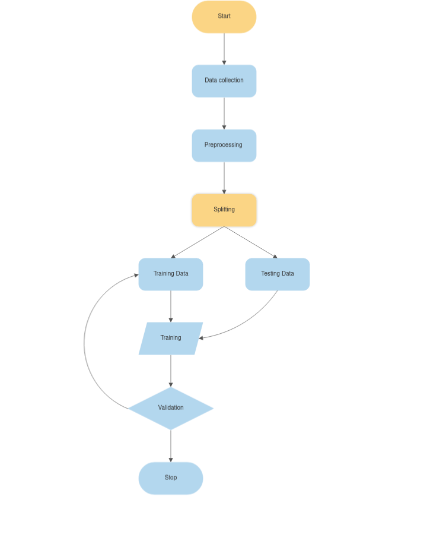

# Cyradar
### (demo https://enemy7-spam-detetor.hf.space/ )

A spam detection system that uses machine learning techniques to accurately detect spam on social media. CyRadar's API facilitates seamless communication with the central server, enabling efficient and precise identification of messages.

# Objectives

 - To identify messages accurately, minimizing false alarms.
- Improve the user experience in a spam-free social media environment.
 - Reduce misinformation by promptly removing spam and other dangerous content.
 - Help users feel safe on the internet by avoiding cyber threats.

# Conclusion
Spam detection is a critical component of any social media platform that aims to deliver a high-quality user experience while prioritizing security and ease of use. By effectively detecting and removing spam and other dangerous content, CyRadar can significantly reduce noise and maintain a safe environment.

In conclusion, the development of CyRadar, a spam detection system that utilizes machine learning techniques, benefits both users and businesses by preventing the spread of misinformation and enhancing overall online experiences.
